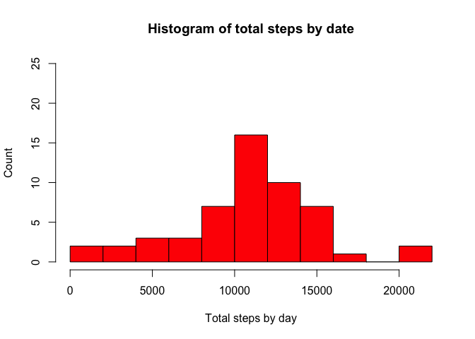
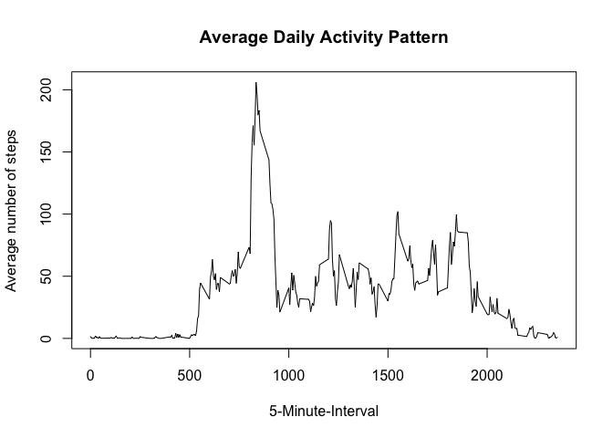
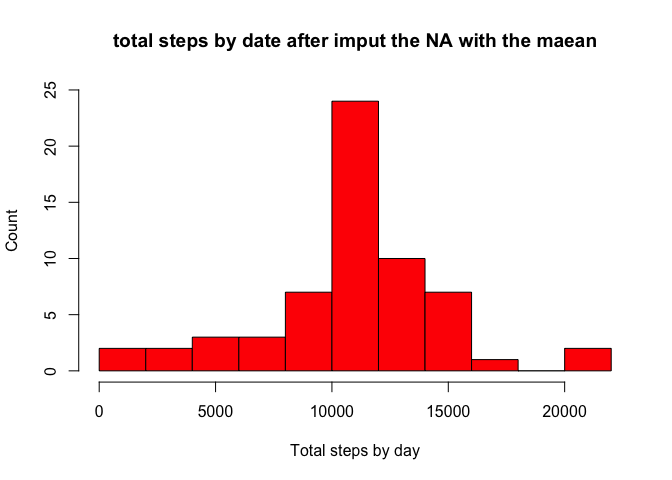
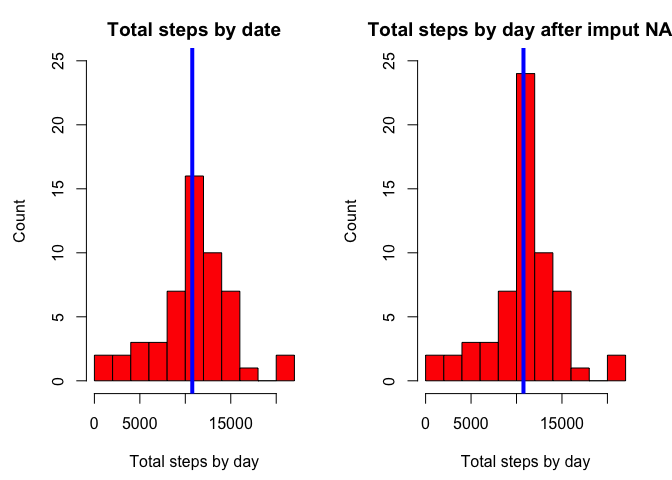
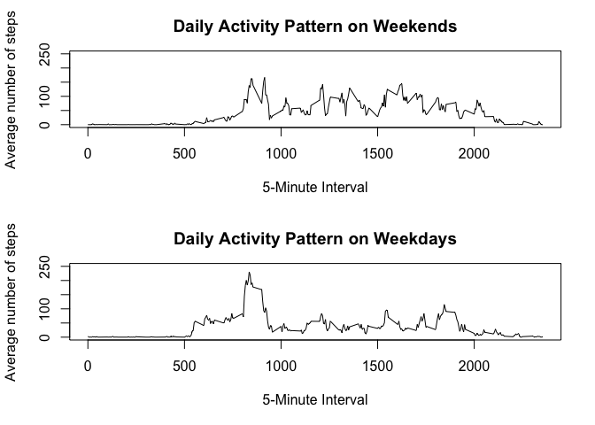

# Reproducible Research: Peer Assessment 1
Iair Linker  
July 19, 2015  


## Loading and preprocessing the data

##This part install the pachages needed to the assignment

```r
if (!require("kernlab")) {
  install.packages("kernlab",repos="http://cran.rstudio.com/")
}
```

```
## Loading required package: kernlab
```

```r
if (!require("plyr")) {
  install.packages("plyr",repos="http://cran.rstudio.com/")
  library(plyr)
}  
```

```
## Loading required package: plyr
```

```r
if (!require("dplyr")) {
  install.packages("dplyr",repos="http://cran.rstudio.com/")
  library(dplyr)
}
```

```
## Loading required package: dplyr
## 
## Attaching package: 'dplyr'
## 
## The following objects are masked from 'package:plyr':
## 
##     arrange, count, desc, failwith, id, mutate, rename, summarise,
##     summarize
## 
## The following object is masked from 'package:stats':
## 
##     filter
## 
## The following objects are masked from 'package:base':
## 
##     intersect, setdiff, setequal, union
```

```r
if (!require("data.table")) {
  install.packages("data.table",repos="http://cran.rstudio.com/")
  library(data.table)
}
```

```
## Loading required package: data.table
## 
## Attaching package: 'data.table'
## 
## The following objects are masked from 'package:dplyr':
## 
##     between, last
```

##Load the data

```r
activity <- read.csv("~/Documents/Formacion/MOOCS/Data Science Certificate/Reproducible Research/activity.csv")
activity <- activity[,1:3]
```

###Question 1: What is mean total number of steps taken per day?
##Clear the NA

```r
activity$date<-as.POSIXct(activity$date)
good<-complete.cases(activity)
activity_no_NA<-activity[good,]
head(activity_no_NA)
```

```
##     steps       date interval
## 289     0 2012-10-02        0
## 290     0 2012-10-02        5
## 291     0 2012-10-02       10
## 292     0 2012-10-02       15
## 293     0 2012-10-02       20
## 294     0 2012-10-02       25
```
##Get the mean of steps by date

```r
dt<-as.data.table(activity_no_NA)
setkey(dt,date)
act_no_NA_mean<-dt[,list(mean=mean(steps)),by=date]
act_no_NA_mean$mean<-round(act_no_NA_mean$mean,1)
head(act_no_NA_mean)
```

```
##          date mean
## 1: 2012-10-02  0.4
## 2: 2012-10-03 39.4
## 3: 2012-10-04 42.1
## 4: 2012-10-05 46.2
## 5: 2012-10-06 53.5
## 6: 2012-10-07 38.2
```
##Histogram of the total number of steps taken per day

```r
setkey(dt,date)
act_no_NA_sum<-dt[,list(sum=sum(steps)),by=date]
hist(act_no_NA_sum$sum,main="Histogram of total steps by date",
     xlab = "Total steps by day",ylab = "Count",col = "red",breaks = "FD",
     ylim=c(0,25))
```

 

```r
data.frame("Mean"=mean(act_no_NA_sum$sum),"Median"=median(act_no_NA_sum$sum))
```

```
##       Mean Median
## 1 10766.19  10765
```
#Question 2:The average daily activity pattern
##The average daily activity pattern

```r
step_by_interval_noNA<-group_by(activity_no_NA,interval)%>%summarise(mean_steps=round(mean(steps),1))
plot(y = step_by_interval_noNA$mean_steps, x = step_by_interval_noNA$interval, 
     type = "l", xlab = "5-Minute-Interval", 
     main = "Average Daily Activity Pattern", ylab = "Average number of steps")
```

 
#Question 3: Imputing missing values
##The sum of the NAs

```r
na<-apply(activity, 1, function(x) sum(is.na(x)))
sum(na)
```

```
## [1] 2304
```
##Imput NA using the mean and create the new matrix with the imputed NA 

```r
indx_steps <- which(is.na(activity$steps))
indx_interval<-activity$interval[indx_steps]
indx_interval_steps<-match(indx_interval,step_by_interval_noNA$interval)
activity_imp<-activity
for(i in 1:length(indx_interval))
{
        activity_imp$steps[indx_steps[i]]<-step_by_interval_noNA[indx_interval_steps[i],2] 
}
activity_imp$steps<-as.double(activity_imp$steps)
head(activity_imp)
```

```
##   steps       date interval
## 1   1.7 2012-10-01        0
## 2   0.3 2012-10-01        5
## 3   0.1 2012-10-01       10
## 4   0.2 2012-10-01       15
## 5   0.1 2012-10-01       20
## 6   2.1 2012-10-01       25
```

##Histogram of the total number of steps taken per day using the new matrix and
##The mean and median of the total nª of steps taken p/day using the new matrix

```r
act_imp_sum<-group_by(activity_imp,date)%>%summarise(sum_steps=round(sum(steps),0))
hist(act_imp_sum$sum,
     main="total steps by date after imput the NA with the maean",
     xlab = "Total steps by day",ylab = "Count",col = "red",breaks = "FD",
     ylim=c(0,25))
```

 

```r
data.frame("Mean"=mean(act_imp_sum$sum),"Median"=median(act_imp_sum$sum))
```

```
##       Mean Median
## 1 10766.16  10766
```
##Plot both graphics so we can see the difference between each other

```r
par(mfrow=c(1,2),mar=c(4,4,2,2),oma=c(0.5,0.5,0.5,0))
hist(act_no_NA_sum$sum,main="Total steps by date",
     xlab = "Total steps by day",ylab = "Count",col = "red",breaks = "FD",
     ylim=c(0,25))
abline(v = median(act_no_NA_sum$sum), col = 4, lwd = 4)
hist(act_imp_sum$sum,
     main="Total steps by day after imput NAs",
     xlab = "Total steps by day",ylab = "Count",col = "red",breaks = "FD",
     ylim=c(0,25))
abline(v = median(act_imp_sum$sum), col = 4, lwd = 4)
```

 

#Question4:Difference in acitivity patterns between weekdays and weekends

##Creating a new factor variable in the dataset with two levels -- 
##"weekday" and "weekend" indicating whether a given date is a weekday or weekend day.

```r
activity_imp$nameday_aux<-weekdays(activity_imp$date)
activity_imp$nameday<-apply(activity_imp[,"nameday_aux",drop=FALSE],1,
                            function(x){
        ifelse(x=="Sunday","Weekend",ifelse(x=="Saturday","Weekend","Weekday"))
})
```
##plot containing a time series plot (i.e. type = "l") of the 5-minute interval 
##(x-axis) and the average number of steps taken,averaged across all weekday days 
##or weekend days (y-axis)

```r
act_imp_weekday<-subset(activity_imp,nameday=="Weekday")
act_imp_weekend<-subset(activity_imp,nameday=="Weekend")
daily_act_weekday<-tapply(act_imp_weekday$steps,act_imp_weekday$interval,mean)
daily_act_weekend<-tapply(act_imp_weekend$steps,act_imp_weekend$interval,mean)
par(mfrow=c(2,1),mar=c(5,4.1,3,2))
plot(y = daily_act_weekend, x = names(daily_act_weekend), type = "l", 
     xlab = "5-Minute Interval", main = "Daily Activity Pattern on Weekends", 
     ylab = "Average number of steps",
     ylim =c(0, 250), xlim=c(0,max(as.integer(names(daily_act_weekend)))))
plot(y = daily_act_weekday, x = names(daily_act_weekday), type = "l", 
     xlab = "5-Minute Interval", main = "Daily Activity Pattern on Weekdays", 
     ylab = "Average number of steps", ylim =c(0, 250),
     xlim=c(0,max(as.integer(names(daily_act_weekday)))))
```

 
